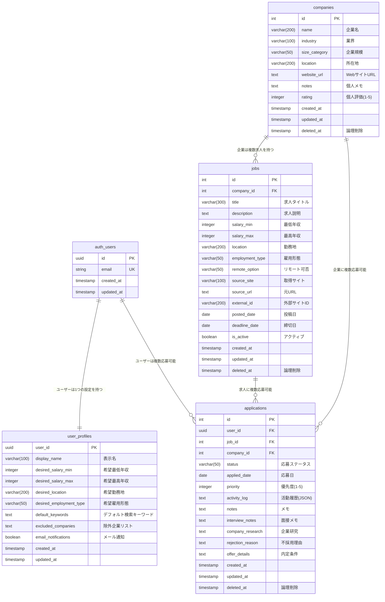

# シンプル転職活動管理システム ER図

## 概要
勤怠管理アプリの設計思想を参考に、4テーブル構成でシンプルに設計した転職活動管理システムのER図です。
核心機能に集中し、複雑な機能は統合・簡素化しています。

## ER図



## テーブル説明

### 🏢 企業・求人管理（2テーブル）
- **companies**: 企業マスタ（名前、業界、個人メモ・評価）
- **jobs**: 求人情報（タイトル、給与、勤務地、外部サイト情報）

### 📋 応募・ユーザー管理（2テーブル）
- **applications**: 応募記録（ステータス、メモ、活動履歴をJSON統合）
- **user_profiles**: ユーザー設定（希望条件、検索設定を統合）

## データ統合仕様

### activity_log JSON構造
```json
{
  "events": [
    {
      "date": "2024-01-16",
      "type": "applied",
      "note": "応募書類提出"
    },
    {
      "date": "2024-01-25",
      "type": "interview",
      "interviewer": "田中部長",
      "note": "技術面接。Goについて質問された",
      "result": "passed"
    },
    {
      "date": "2024-02-01",
      "type": "offer",
      "note": "内定通知受領",
      "salary": "800万円"
    }
  ]
}
```

### リレーション構造
```
auth_users → user_profiles (1:1)
     ↓
applications → jobs → companies (1:N)
```

## 制約・ルール

### 一意制約
- `companies.name`: 企業名重複防止
- `(source_site, external_id)`: 同じサイトの求人重複防止
- `(user_id, job_id)`: 同じ求人への重複応募防止

### チェック制約
- `companies.rating`: 1-5の範囲
- `applications.priority`: 1-5の範囲
- `applications.status`: 定義済みステータスのみ

### 外部キー制約
```sql
jobs.company_id → companies.id
applications.user_id → auth_users.id
applications.job_id → jobs.id
applications.company_id → companies.id
user_profiles.user_id → auth_users.id
```

## インデックス戦略（勤怠管理と同等）

### 検索用インデックス
- `jobs.title` (全文検索)
- `companies.name`
- `applications(user_id, status)`

### フィルタ用インデックス
- `jobs(salary_min, salary_max)`
- `jobs.location`
- `applications.applied_date`

### パフォーマンス用インデックス
- `jobs(is_active, posted_date)`
- 各テーブルの `deleted_at`

## 拡張可能性

### テーブル追加候補
1. **application_events**: 詳細な履歴管理
2. **job_searches**: 保存済み検索条件
3. **scraping_jobs**: 自動化機能
4. **分析用ビュー**: 集計・レポート機能

### システム成長パス
```
Phase 1: 4テーブル構成（現在）
Phase 2: 5-6テーブル構成
Phase 3: 8テーブル構成（フル機能）
```